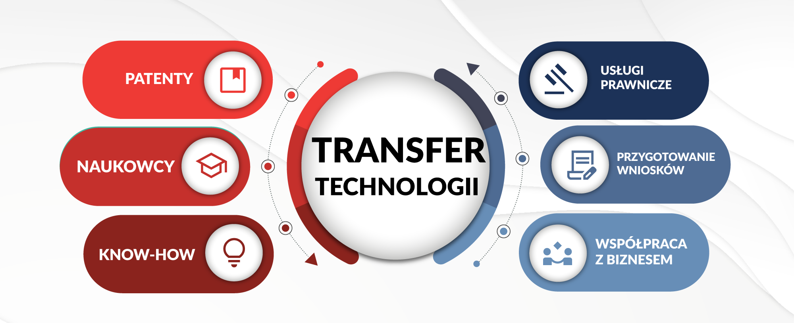

Wprowadzenie
=======================

Transfer technologii i wymogi regulacyjne.

Transfer technologii
-----------------------

To proces przenoszenia jakiejś technologii, której właścicielem jest jednostka lub organizacja do innej jednostki lub organizacji.

Czyli poprostu komercjalizacja jakieś wiedzy, przenieśienie z teorii do praktycznego rozwiązania.

Wymogi regulacyjne
-----------------------

Wymogi regulacyjne dotyczące transferu technologii różnią się w zależności od charakteru transferowanej technologii, zaangażowanych stron i krajów, w których transfer ma miejsce.
Ogólnie rzecz biorąc, wymogi regulacyjne mają na celu zapewnienie, że transfer technologii odbywa się w sposób bezpieczny i etyczny, a prawa wszystkich zaangażowanych stron są chronione.
